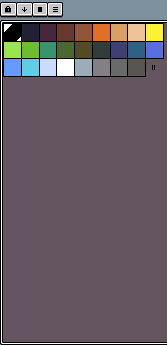

Looking to get started with Pixel Art for your games but don't really know where to start? Well you're not alone! Lots of us have been there and lots of us will be there. One of my favourite tools for creating Pixel Art is Aseprite. You can get it from their [website](https://www.aseprite.org/), [steam](https://store.steampowered.com/app/431730/Aseprite/) for only $21.50AUD or $15 USD.  

Aseprite is specifically created for creating and animating Pixel Art. The interface in incredible simple and clean and you'll be ready to get started by the end of this blog.

Let's go over what we're going to cover today. 

1. Canvas
2. Sprite Preview
3. Colour Palette
4. Colour Selection
5. Tools
6. Layers

Once you know how to use these 6 sections, you'll be able to achieve Sprite Art goodness. Let's begin!

## Canvas

This is your main play area. This is where magic really happens. The canvas is the area where you draw all your pixels. When you create a new sprite, you can choose it's size. Some standard sizes are 8x8, 16x16, 32x32, 64x64 etc. They go up in powers of 2. The main thing you'll be doing to the canvas is using your brush tool and drawing pixels onto it like so:

We'll cover the brush tool again soon, but to have a quick go with it right now, press `B` on your keyboard to select the brush tool and you can start drawing to your canvas straight away. You can scroll on the mouse wheel to zoom the canvas in and out. This is super helpful when you're working with really small sprites. But what if you want to work zoomed in and still see what they look like at a different size while you work? 

## Sprite Preview

Well you can! The sprite preview window is your ticket to making sure your sprites look awesome at their intended size. When you're zoomed into your canvas, your sprite preview window can be zoomed to a different size. Check it out:

Make sure you keep your Preview zoomed out enough that you get a clear idea of what your sprite looks like at it's intended size. You'll find it can look drastically different zoomed in and zoomed out. 

A few neat tricks with this window. If you select this button  it will center your sprite in the preview and if you select this button  you can preview your animation, but we're not covering animation today, but we'll have a blog on that soon! 

## Colour Palette

Time to switch gears and look colour for a bit. The Colour Palette can be used to select all the colours you wish to use for that particular piece of work. This is by no means the only colours you can use though! You're still free to use the colour wheel which we'll cover next.

When you start a new sprite, you'll get a default colour palette. They can be any size, you've just got to drag the || icon to change it like below:

If you don't want to make your own palette, there's plenty to choose from as defaults. 

## Colour Selection

## Tools

There's heaps of useful tools for you to use in Aseprite, so let's start going over them. Tools are found on the right by default and look like this

We'll go through them from top to bottom

### Selection

As the name suggests, all these tools are about selecting parts of the canvas. The first and second selection allow you to select a rectangle of space and a circle of space respectively. 

## Layers

