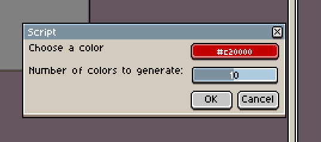

Aseprite is an incredibly powerful Pixel Art tool on it's own, but did you know it's possible to extend it's functionality even further by writing your own plugins? Well you can! Today we're going to take a look at how we'd do that to make a plugin that we specify a colour and how many shades and highlights we want, then it spits out a palette with all our colours. I've found this plugin to be super useful when shading or adding highlights, so let's get started.

Once we're done, our plugin will look like this:



And will generate us a palette that looks like this:


First we need to know how to install and run scripts. This is pretty simple in Aseprite. 

### Adding Scripts
1. Go to File -> Scripts
2. Click `Open Scripts Folder`
3. Place your scripts into this folder
4. Restart Aseprite 

### Running Scripts
1. Go to File -> Scripts
2. Select your script from the menu


It's really that easy. 

## Before we start

There's a few things we'll want to know before we get started. Firstly, plugins are written in [Lua](https://www.lua.org/). If you're unfamiliar with Lua, you follow along [here to get started](https://www.lua.org/pil/1.html).

Next thing we'll want to know where to see the API docs. Aseprite API is hosted publically in this [repository](https://github.com/aseprite/api). Here you can find all the hooks for your plugin, provided functions and more. Once you're finished with this tutorial, you'll want to check out the docs to make all the plugins you can think of!

## Lets get started

Follow the steps above about adding scripts or navigate to the folder yourself. In the folder, we'll want to create a new file called `shade-palette.lua`. Once you've got that, open it up in your favourite text editor.

We're going to make the dialog first. This is pretty easy with the [Dialog API](https://github.com/aseprite/api/blob/master/api/dialog.md#dialog). We can create a new dialog with `Dialog()`. To add buttons we can use `Dialog():button` on a dialog, colour fields can be done with `Dialog():color` and finally sliders can be made with `Dialog():slider`. With all this knowledge, we make easily make the dialog for the user to interact with the plugin with the following:

```
function showDialogForColour()
    
    return Dialog():color{ id="colour", label="Choose a color", color=Color{r=0,g=0,b=0,a=255} }
	:slider{ id="number_of_shades", label="Number of shades to generate:", min=1, max=20, value=10 }
    :button{ id="ok", text="OK" }
    :button{ id="cancel", text="Cancel" }
    :show().data;

end

showDialogForColour();
```

This will create a dialog with a colour picker which defaults to black and says "Choose a colour", put a slider under which is set to 10 and can slide from 1 to 20, then add two buttons for `OK` and `Cancel` which do exactly as they say.

Now we have a plugin that shows a dialog, but nothing else. Let's add some more functionality. Remove the last line `showDialogForColour()` and we'll read the data coming back.

```
do
    local color = showDialogForColour()
    if color.ok then
		shades = color.number_of_shades;
        return app.alert(shades);
    end
end
``

First we're calling `showDialogForColour()` which will display the dialog and wait for the OK to be hit. Then we'll check if the element with the id `ok` which was the OK button is set, and if so, we'll read the value of `number_of_shades` from the object which was set from the colour slider. Finally, we'll alert this out to see the effect. Try setting different values for the shade count and see if change.